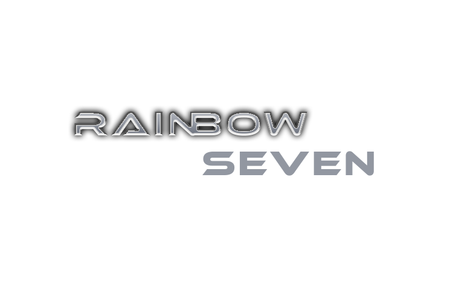

# Rainbow Seven Siege - School Project

This is my school project in Human Computer Interaction Laboratory subjects. This is a group project that consists of 4 people. The role is 1 designer, 1 designer and coder, 2 coder.

## Links to This School Project
https://lgenesius.github.io/rainbowseven.github.io/

## Descriptions
This project made on June 12, 2020 during semester 4 in university.  
My role in this project is coder. I coded the Home Page, Operator Page (Consists of Saviour page and Protector page), and Quarantine Page.  
▸ For the Home page, I used HTML, CSS and Javascript. Javascript used in the image slider in Home page. 
▸ For the Saviour page and Protector page, I used HTML, CSS and Javascript. Javascript used in the operator detail that when you click the one   of the displayed operators image, it will reveal the detail information of the operator. 
▸ For the Quarantine Page, I used HTML and CSS.

## Technologies
▸ HTML 
▸ CSS 
▸ Javascript 
▸ Text Editor: Visual Studio Code

 
